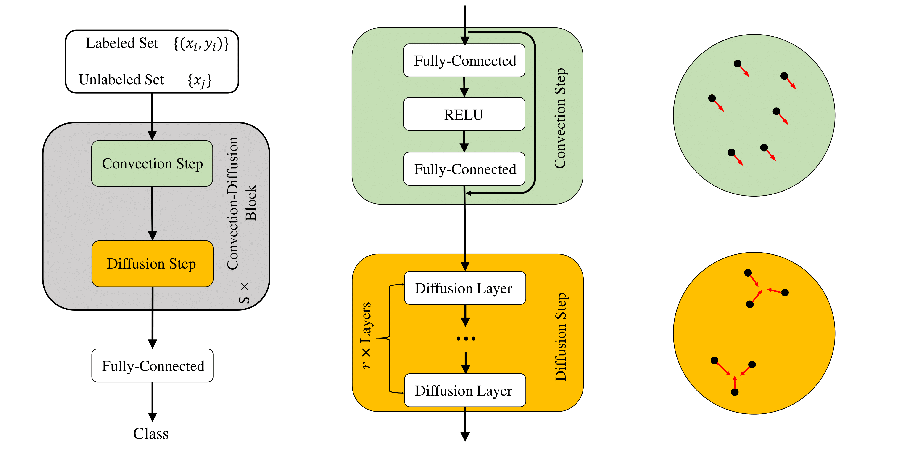

# Diffusion Mechanism in Neural Network: Theory and Applications

This repository contains the code for Diff-ResNet implemented with PyTorch. 

More details in paper:
[**Diffusion Mechanism in Residual Neural Network: Theory and Applications**](https://ieeexplore.ieee.org/document/10114599)

## Introduction
Inspired by the diffusive ODEs, we propose a novel diffusion residual network (Diff-ResNet) to strengthen the interactions among data points. Diffusion mechanism can decrease the distance-diameter ratio and improves the separability of data points. Figure below shows the evolution of points with diffusion.
<div align=center>

</div>

The figure describes  the architecture of our network.
<div align=center>

</div>

## Synthetic Data
We offer several toy examples to test the effect of diffusion mechanism and for users to understand how to use diffusion in a **plug-and-play** manner. 

They can serve as minimal working examples of diffusion mechanism. Simply run each python file.

## Graph Learning
Code is adapted from [**Pitfalls of graph neural network evaluation**](https://github.com/shchur/gnn-benchmark/tree/master/gnnbench). Users can test our Diff-ResNet on dataset cora, citeseer and pubmed for 100 random dataset splits and 20 random initializations each. One should provide step_size and layer_num. Specific parameter choice for reproducing results in paper is provided in the appendix.

```
python train.py --dataset cora --step_size 0.25 --layer_num 20 --dropout 0.25
```

## Few-shot
### 1. Dataset
Download [miniImageNet](https://mega.nz/file/2ldRWQ7Y#U_zhHOf0mxoZ_WQNdvv4mt1Ke3Ay9YPNmHl5TnOVuAU), [tieredImageNet](https://mega.nz/file/r1kmyAgR#uMx7x38RScStpTZARKL2DwTfkD1eVIgbilL4s20vLhI) and [CUB-100](https://mega.nz/file/axUDACZb#ve0NQdmdj_RhhQttONaZ8Tgaxdh4A__PASs_OCI6cSk). Unpack these dataset in to corresponding dataset name directory in [data/](./fewshot/data/).

### 2. Backbone Training
You can download pretrained models on base classes [here](https://mega.nz/file/f5lDUJSY#E6zdNonvpPP5nq7cx_heYgLSU6vxCrsbvy4SNr88MT4), and unpack pretrained models in fewshot/saved_models/.

Or you can train from scratch by running [train_backbone.py](./fewshot/backbone/train_backbone.py).

```
python train_backbone.py --dataset mini --backbone resnet18 --silent --epochs 100
```

### 3. Diff-ResNets Classification
Run [train.py](./fewshot/train.py) with specified arguments for few-shot classification.  Specific parameter choice for reproducing results in paper is provided in the appendix. See argument description for help.
```
python train.py --dataset mini --backbone resnet18 --shot 1 --method diffusion --step_size 0.5 --layer_num 6
```

## Citation
If you find Diff-ResNets useful in your research, please consider citing:
```
@article{wang2024diffusion,
  author={Wang, Tangjun and Dou, Zehao and Bao, Chenglong and Shi, Zuoqiang},
  journal={IEEE Transactions on Pattern Analysis and Machine Intelligence}, 
  title={Diffusion Mechanism in Residual Neural Network: Theory and Applications}, 
  year={2024},
  volume={46},
  number={2},
  pages={667-680},
  doi={10.1109/TPAMI.2023.3272341}
}
```
